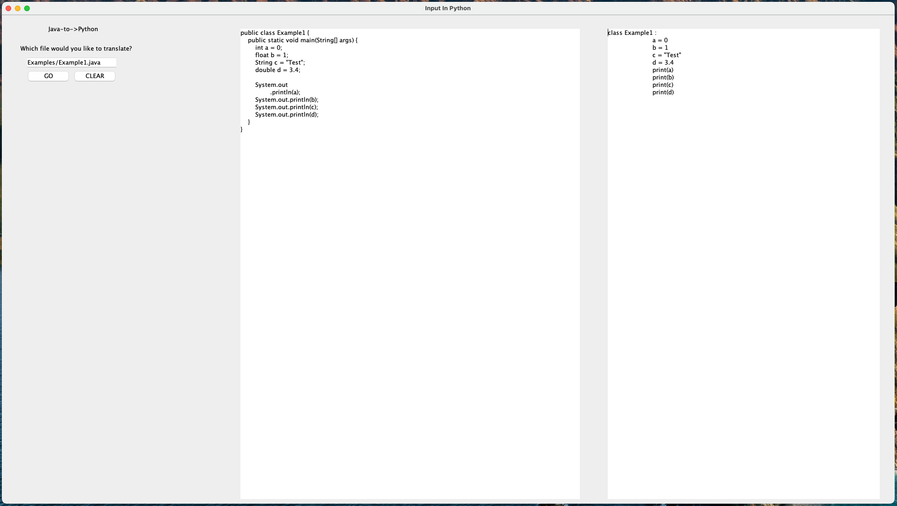
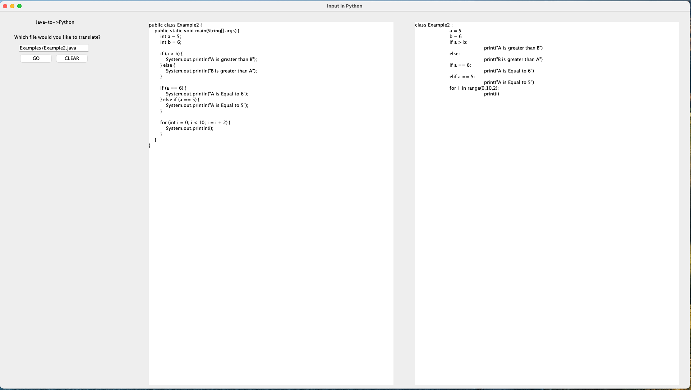
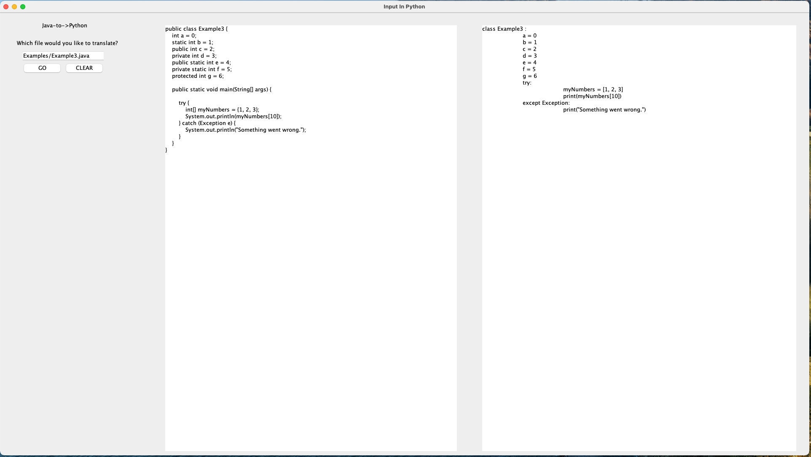
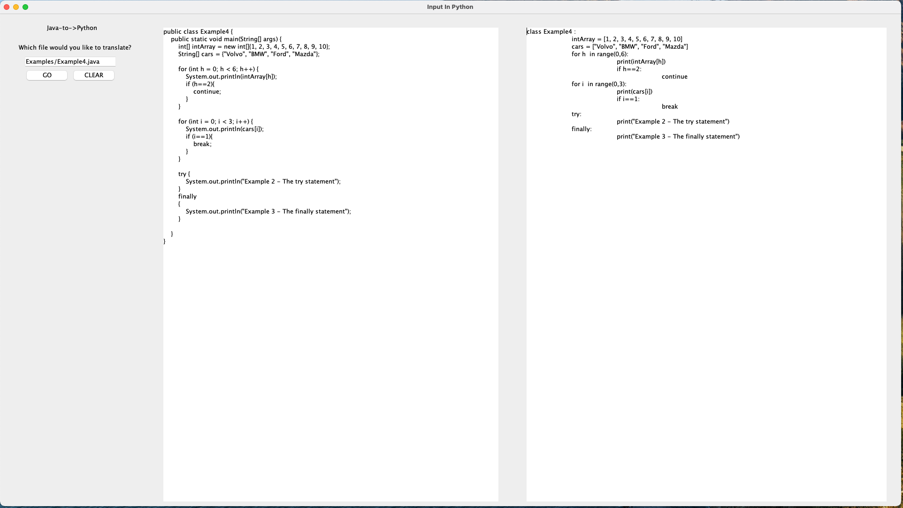
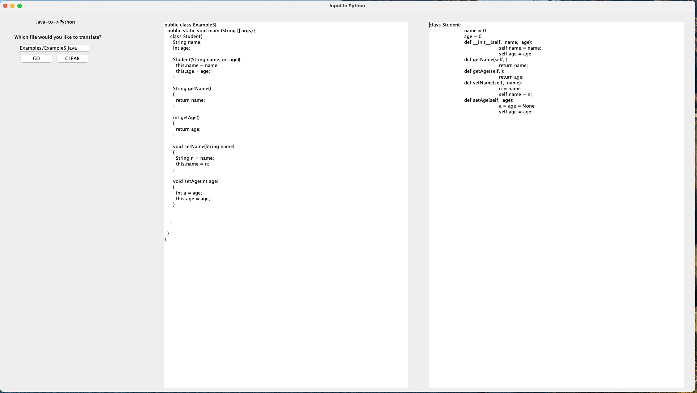

# JavaToPython
This program take simple and syntaxtically correct java code and will convert it into the equivalent version in Python syntax.

Teams Members that contributed to this project: Marcus, Ivan, Kwasi, Benard, Murphy, David.

My role was to create the User Interface and display the output. Also i contributed on serveral functions that helped convert the java code into python.

Functions i contrubuted: (For Loops, Try/Catch Commands, Break/Continue Commands).

Conversion of diferent data types

Conversion of If and Else statements and For Loops 

Conversion of Try/Catch Statements & Classes & Java Access Modifiers

Conversion of Arrays of Int and String Type

Conversion of Object Oriented Programming 

